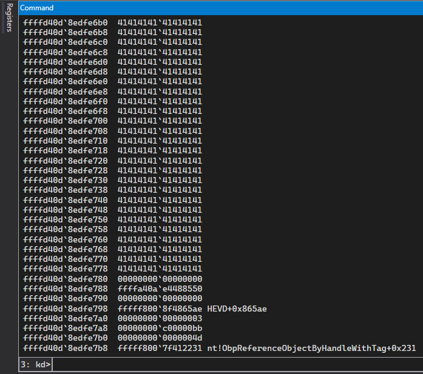
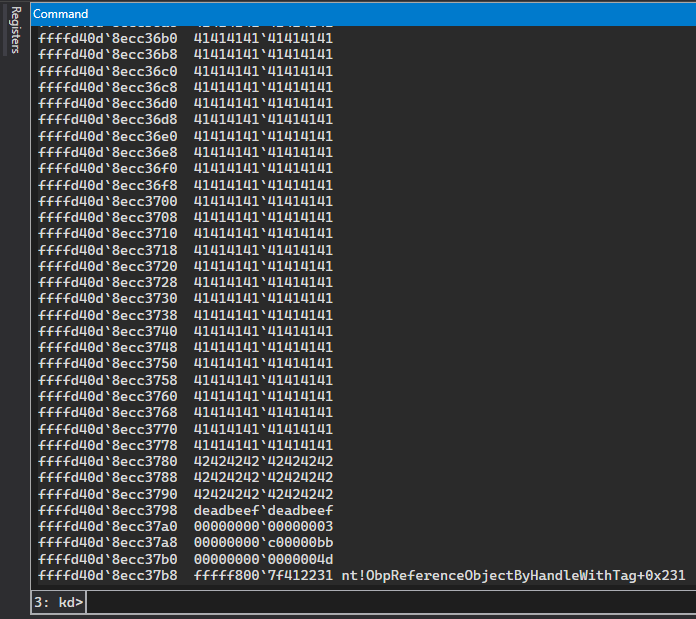
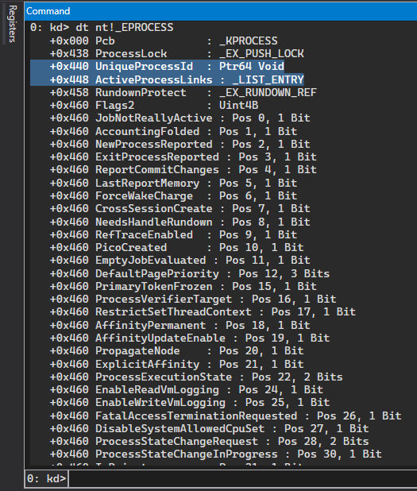

# Stack Buffer Overflow - x64 Windows 10 22H2 (No SMEP)


# Contents
* [Reverse Engineering](https://github.com/Slimicide/HEVD-Exploits/tree/main/STACK_BUFFER_OVERFLOW#reverse-engineering)
  * [The Bug](https://github.com/Slimicide/HEVD-Exploits/tree/main/STACK_BUFFER_OVERFLOW#the-bug)
* [The Exploit](https://github.com/Slimicide/HEVD-Exploits/tree/main/STACK_BUFFER_OVERFLOW#the-exploit)
  * [Shellcode and SMEP](https://github.com/Slimicide/HEVD-Exploits/tree/main/STACK_BUFFER_OVERFLOW#shellcode-and-smep)
  * [Debugging](https://github.com/Slimicide/HEVD-Exploits/tree/main/STACK_BUFFER_OVERFLOW#debugging)
* [References](https://github.com/Slimicide/HEVD-Exploits/tree/main/STACK_BUFFER_OVERFLOW#references)

# Reverse Engineering
HEVD is completely open-source and has debug symbols available for download, but I undertook this project to build some confidence in black-box
reverse engineering with IDA and WinDBG considering that will be the case most of the time with other binaries.

When approaching Windows drivers, there are two points of immediate interest:
* **The device name** -> Required to open a handle to and interact with the driver.
* **The IOCTL dispatcher routine** -> Holds a list of functions that can be called by supplying their corresponding IOCTL code.

Every driver has an [EntryPoint](https://learn.microsoft.com/en-us/windows-hardware/drivers/wdf/driverentry-for-kmdf-drivers) routine that gets called every time a new driver gets loaded.


Inside this routine is the function that will initialize the driver and reveal the name of the device (function names changed for convenience).


In this screenshot, I have already identified and renamed the function responsible for dispatching calls to the driver with IOCTL codes but it is easy
to find yourself, at least in HEVD. 

HEVD annotates each valid IOCTL code with a string telling you what it does. Simply go to the `Strings` view in IDA,
find the description you're after and follow the single cross-reference to find it sitting in the IOCTL dispatcher.


The `BUFFER_OVERFLOW_STACK` function exists under the IOCTL code `0x222003`.
This IOCTL code can now be used in a usermode function call to [DeviceIoControl](https://learn.microsoft.com/en-us/windows/win32/api/ioapiset/nf-ioapiset-deviceiocontrol)
in conjunction with a handle to the driver we can obtain using the driver's name discovered in the HEVD intialization function, allowing us to directly interact with the `BUFFER_OVERFLOW_STACK` function.

## The Bug
Inside the `BUFFER_OVERFLOW_STACK` function is another function I've named `BUFFER_OVERFLOW_STACK_EXECUTOR` that actually sets up the vulnerability.

The kernel buffer is initialized at a size of 2048 bytes (0x800) before it is sent off to a function I've called `BUFFER_OVERFLOW_STACK_CORRUPTOR` alongside our usermode buffer and usermode buffer size.


The bug occurs relatively early in this function. This function takes the address of the kernel buffer and adds it to the size of the usermode buffer without any
bounds checking or limitations on how big the usermode buffer can be. As we'll soon see `pKernPlusUserSize` holds the address that will be written to. 
It begins at the end and works back towards the top. There is nothing stopping it from being larger than the 0x800 bytes allocated for it, 
enabling it to overflow and overwrite unrelated data on the stack.


To visualize this problem, take a scenario where the kernel buffer begins at address `0x0000` and the user buffer is `0x0900` in size:


The part responsible for the actual writing is further down. It takes `pKernPlusUserSize`and fills the buffer until it has written `UserBufferSize` number of bytes.


# The Exploit
Now that we have a strong understanding of the bug and how to trigger it, we can attach a kernel debugger to the development machine and experiment with different payloads.
Through this bug, we have the ability to overwrite anything we want on the stack. Typically the target would be hijacking the flow of execution by overwriting the current function's return address.

When a new function is called, a return address is pushed onto the stack so that once the called function concludes, it can use a `ret` (return) instruction to pop that return address back into the instruction
pointer to continue the flow of execution. By overwriting that return address, we can hijack execution to go wherever we want.

This time will be no different. The goal is the RIP register.

We can start by setting a breakpoint at the end of the corruptor function. At the time of writing, this can be achieved with `bp HEVD+13b1` in WinDBG.
Now, by sending 0x800 bytes of data to the overflow function, we can inspect the uncorrupted stack and find the return address to find out exactly how many bytes we need to exceed
the buffer by in order to overwrite the return address.



This is what a full, intended buffer looks like. Nothing on the stack has been overwritten. Yet. We need to overflow the buffer by `0x20` bytes in order to overwrite the return address.
By sending another `0x18` bytes of junk followed by `0x8` bytes of an arbitrary address, we can verify that the return address is overwritten.



Now the return address has been completely overwritten by `0xdeadbeefdeadbeef`. This address isn't in use and upon executing `ret` from this function, the machine should crash.


As expected, we get an Access Violation caused by the execution of the `ret` instruction on a non-existent address. It's important to note that while we can overwrite the return address, we shouldn't
discard it outright and pretend it was never there. By clobbering and overwriting a return address, we deprive the binary of all of the instructions present at that return address. Those instructions
are almost certainly required and expected to have been executed by subsequent functions. If we overwrite the return address, we need to know what instructions were present there so we can emulate it
afterwards.

Here is the graph view of the return address we will be overwriting:


Thankfully, it's very very simple. Whatever we do, we need to make sure we execute `add rsp, 0x28` before we return out of our hijacked execution flow. 

But the question still stands, what address should we redirect execution to?

## Shellcode and SMEP
We of course have the means to allocate our own chunk of memory by using functions such as [VirtualAlloc](https://learn.microsoft.com/en-us/windows/win32/api/memoryapi/nf-memoryapi-virtualalloc).

By specifying we want this new allocation to be executable, we can safely overwrite the return address with the address of this new allocation and write instructions of our own for the kernel to execute.
Normally, there's a mitigation against doing exactly this called **Supervisor Mode Execution Protection** (SMEP)
SMEP exists to prevent a thread in kernel mode from executing instructions stored at a user mode address.
It's not too tricky to bypass, but for some reason my development virtual machine doesn't have SMEP enabled so I will proceed without the need for a SMEP bypass (at least for now).

A popular choice for kernel mode shellcode is token-stealing shellcode.
The purpose of this shellcode is to find the SYSTEM process (PID 4) and copy its access token (NT AUTHORITY\SYSTEM) onto the current process to spawn a free shell as the SYSTEM user.

For my exploit, I opted to modify [Connor McGarr](https://twitter.com/33y0re)'s token-stealing shellcode from his blogpost on 
[Kernel Mode Shellcode and Exploit Development](https://connormcgarr.github.io/x64-Kernel-Shellcode-Revisited-and-SMEP-Bypass/). Connor McGarr makes excellent blog posts on all sorts of different
exploit development topics and is mostly responsible for my interest in exploring the area.

Anyway, here is his unmodified shellcode:
```py
payload = bytearray(
    "\x65\x48\x8B\x04\x25\x88\x01\x00\x00"              # mov rax,[gs:0x188]  ; Current thread (KTHREAD)
    "\x48\x8B\x80\xB8\x00\x00\x00"                      # mov rax,[rax+0xb8]  ; Current process (EPROCESS)
    "\x48\x89\xC3"                                      # mov rbx,rax         ; Copy current process to rbx
    "\x48\x8B\x9B\xE8\x02\x00\x00"                      # mov rbx,[rbx+0x2e8] ; ActiveProcessLinks
    "\x48\x81\xEB\xE8\x02\x00\x00"                      # sub rbx,0x2e8       ; Go back to current process
    "\x48\x8B\x8B\xE0\x02\x00\x00"                      # mov rcx,[rbx+0x2e0] ; UniqueProcessId (PID)
    "\x48\x83\xF9\x04"                                  # cmp rcx,byte +0x4   ; Compare PID to SYSTEM PID
    "\x75\xE5"                                          # jnz 0x13            ; Loop until SYSTEM PID is found
    "\x48\x8B\x8B\x58\x03\x00\x00"                      # mov rcx,[rbx+0x358] ; SYSTEM token is @ offset _EPROCESS + 0x348
    "\x80\xE1\xF0"                                      # and cl, 0xf0        ; Clear out _EX_FAST_REF RefCnt
    "\x48\x89\x88\x58\x03\x00\x00"                      # mov [rax+0x358],rcx ; Copy SYSTEM token to current process
    "\x48\x83\xC4\x40"                                  # add rsp, 0x40       ; RESTORE (Specific to HEVD)
    "\xC3"                                              # ret                 ; Done!
)
```

Shellcode is essentially just the raw bytes that make up different CPU instructions. The format here is:

```
"Raw bytes of the instruction"         # The corresponding instruction in assembly ; The goal of the instruction
```

Proceding with this shellcode unmodified on my setup will cause a near instant crash. This is because the structures accessed such as `KTHREAD` and `EPROCESS` are subject to change.
The offsets present in this shellcode are not the offsets present on my machine, they may not be the offsets on your machine either. Thankfully it is easy to check.

In WinDBG, `dt nt!_KTHREAD` to check offsets for `KTHREAD`, `dt nt!_EPROCESS` to check offsets for `EPROCESS`.

For me, my `EPROCESS` was different and the value I needed to add to `RSP` at the end was `0x28` as we saw earlier.



For my machine, 
* `ActiveProcessLinks` is at `+0x448`, not `+0x2e8`
* `UniqueProcessId` is at `+0x440`, not `+0x2e0`
* `Token` is at `+0x4b8`, not `+0x358`

After implementing these changes into the shellcode... I still crashed?

## Debugging

When things go wrong, the goal is to make your exploit behave as close to the legitimate call as possible to minimize the amount of things that can potentially go wrong.
Considering I had not triggered SMEP on account of it not being active AND restoring the instruction located at the clobbered return address, the only thing that could be going wrong
is the state of the registers, potentially caused by using them for shellcode. I tried pushing `RAX`, `RBX` and `RCX` before the shellcode and popping them back in afterwards, but nothing changed.

I made a clean, non-overflowing call to the function and took a look at the registers:


I then made a call with the exploit active and compared the registers:


The problem made itself clear.

If `RAX`, `RBX` and `RCX` weren't the issue, `R12`, `R14` and `R15` likely were. Those registers are filled with `BBBBBBBB` meaning they were popped in from the `0x18` overflow just before
the return address overwrite. It's only now that I'm writing this that I realize I could have solved this problem by simply sending null bytes into the place of `R12` and `R15`, but I did something else.

`R14` holds an actual value in the legitimate call, if that's what's crashing, that'd be an annoying fix. Going for the low-hanging fruit first and attempting to zero `R12` and `R15` was the best move.

I added `xor R12, R12` and `xor R15, R15` to the end of my shellcode to zero them out and fortunately, everything worked as expected. The SYSTEM token was applied to my current process and I was able to spawn
an elevated `cmd.exe`.

Exploit script written in Python available in this repository.

# References
[HackSysTeam](https://github.com/hacksysteam) - Creating the invaluable [HackSysExtremeVulnerableDriver](https://github.com/hacksysteam/HackSysExtremeVulnerableDriver)

[VoidSec](https://voidsec.com/) - For their excellent blog post on the [Windows Drivers Reverse Engineering Methodology](https://voidsec.com/windows-drivers-reverse-engineering-methodology/)

[Connor McGarr](https://twitter.com/33y0re) - For his talent at writing accessible, entertaining [blog posts](https://connormcgarr.github.io/) to otherwise seemingly inaccessible topics
