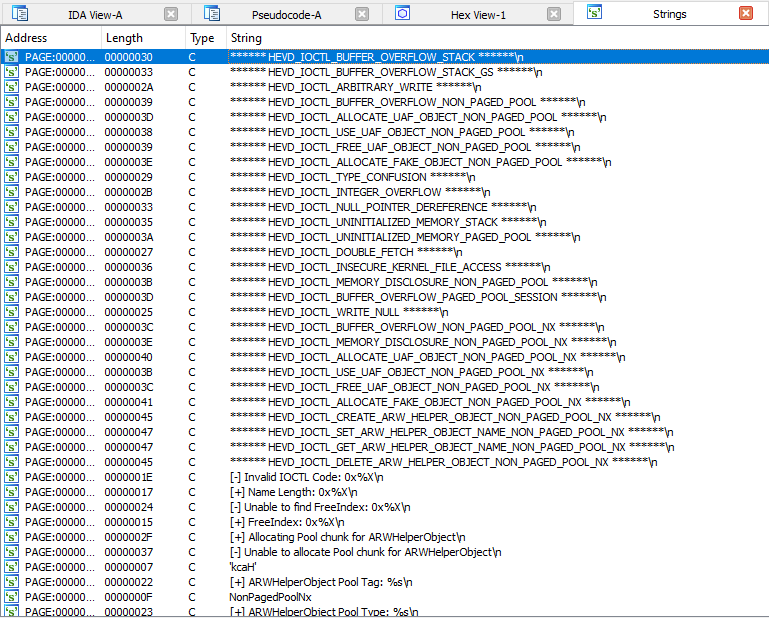
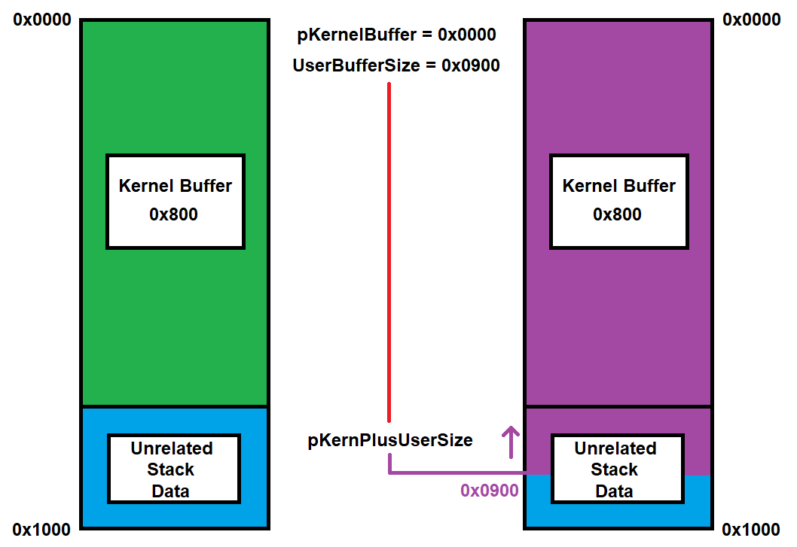

# Stack Buffer Overflow - x64 Windows 10 22H2 (No SMEP)

# Reverse Engineering
HEVD is completely open-source and has debug symbols available for download, but I undertook this project to build some confidence in black-box
reverse engineering with IDA and WinDBG considering that will be the case most of the time with other binaries.

When approaching Windows drivers, there are two points of immediate interest:
* **The device name** -> Required to open a handle to and interact with the driver.
* **The IOCTL dispatcher routine** -> Holds a list of functions that can be called by supplying their corresponding IOCTL code.

Every driver has an [EntryPoint](https://learn.microsoft.com/en-us/windows-hardware/drivers/wdf/driverentry-for-kmdf-drivers) routine that gets called every time a new driver gets loaded.

Inside this routine is the function that will initialize the driver and reveal the name of the device (function names changed for convenience).

In this screenshot, I have already identified and renamed the function responsible for dispatching calls to the driver with IOCTL codes but it is easy
to find yourself, at least in HEVD. 

HEVD annotates each valid IOCTL code with a string telling you what it does. Simply go to the `Strings` view in IDA,
find the description you're after and follow the single cross-reference to find it sitting in the IOCTL dispatcher.

The `BUFFER_OVERFLOW_STACK` function exists under the IOCTL code `0x222003`.
This IOCTL code can now be used in a usermode function call to [DeviceIoControl](https://learn.microsoft.com/en-us/windows/win32/api/ioapiset/nf-ioapiset-deviceiocontrol)
in conjunction with a handle to the driver we can obtain using the driver's name discovered in the HEVD intialization function, allowing us to directly interact with the `BUFFER_OVERFLOW_STACK` function.

## The Bug
Inside the `BUFFER_OVERFLOW_STACK` function is another function I've named `BUFFER_OVERFLOW_STACK_EXECUTOR` that actually sets up the vulnerability.

The kernel buffer is initialized at a size of 2048 bytes (0x800) before it is sent off to a function I've called `BUFFER_OVERFLOW_STACK_CORRUPTOR` alongside our usermode buffer and usermode buffer size.

The bug occurs relatively early in this function. This function takes the address of the kernel buffer and adds it to the size of the usermode buffer without any
bounds checking or limitations on how big the usermode buffer can be. As we'll soon see `pKernPlusUserSize` holds the address that will be written to. 
It begins at the end and works back towards the top. There is nothing stopping it from being larger than the 0x800 bytes allocated for it, 
enabling it to overflow and overwrite unrelated data on the stack.

To visualize this problem, take a scenario where the kernel buffer begins at address `0x0000` and the user buffer is `0x0900` in size:

